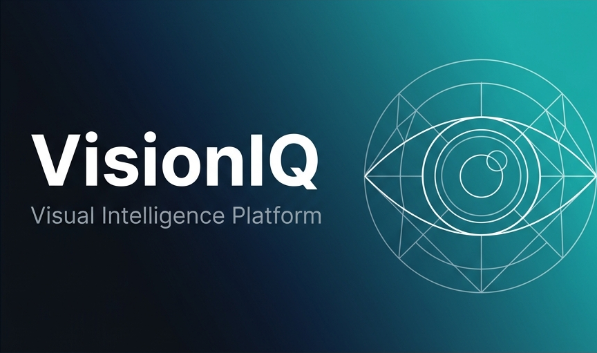

# VisionIQ 👁️✨

**VisionIQ** is a state-of-the-art AI-powered Visual Intelligence Platform that analyzes, understands, and extracts knowledge from physical objects and images. 

Built with a robust microservice-oriented architecture and a sleek, dynamic user interface, VisionIQ enables seamless visual data processing using advanced Large Language Models (LLMs) and Retrieval-Augmented Generation (RAG).



---

## 🚀 Key Features

### 🧠 Intelligent Vision Processing
- **Image Scanning & Analysis**: Upload physical objects, documents, or scenery for instant AI breakdown.
- **RAG-Powered AI Chat**: Have contextual conversations with the AI about your uploaded images. The AI retrieves specific details from your past scans to provide highly accurate, memory-aware responses.

### 🔐 Secure & Scalable Architecture
- **JWT Authentication Flow**: Fully secure registration, login, and robust session management with token rotation.
- **Enterprise-Grade Backend**: Built with **FastAPI** following Clean Architecture principles. Includes centralized error handling, structured logging, and dependency injection.
- **Vector Search Engine**: Employs PostgreSQL with `pgvector` for lightning-fast semantic search across your visual knowledge base.

### 🎨 Premium User Experience
- **Modern Next.js Frontend**: Highly responsive interface built on the Next.js 14 App Router and React Query.
- **Dynamic Theming**: Seamlessly switch between light, dark, and system themes with persistent user preferences.
- **Glassmorphism & Micro-animations**: A fluid, premium aesthetic featuring tailored HSL color palettes and smooth Framer Motion transitions.

---

## 🏗️ Tech Stack

**Frontend:** Next.js 14, React, Tailwind CSS, Radix UI, React Query, Framer Motion, Next-Themes  
**Backend:** Python, FastAPI, SQLAlchemy (PostgreSQL + pgvector), Alembic, Pydantic, Tenacity  
**AI & Search:** Google Gemini 2.0 (Multimodal Vision + Chat), LangChain, HuggingFace Embeddings  
**Infrastructure:** Docker, Docker Compose, Redis

---

## ⚙️ Development Setup

The entire stack is containerized with Docker for a seamless 1-click launch.

1. **Clone the repository & setup environment files**
   ```bash
   cp .env.example .env.development
   ```

2. **Configure your AI Keys** (in `.env.development`)
   ```env
   LLM_PROVIDER=gemini
   GOOGLE_API_KEY=your_gemini_api_key_here
   GEMINI_MODEL=gemini-2.0-flash
   ```
   *Note: If no API key is provided, set `LLM_PROVIDER=mock` to run the app entirely offline with mock responses.*

3. **Launch the platform**
   ```bash
   docker-compose up --build
   ```
   *The backend container will automatically wait for the database and execute all Alembic migrations.*

4. **Access the services**
   - **Frontend App**: [http://localhost:3000](http://localhost:3000)
   - **Backend API Docs (Swagger)**: [http://localhost:8000/api/v1/docs](http://localhost:8000/api/v1/docs)

---

## 💾 Database Migrations

The database schema is managed via Alembic. 

**To generate a new migration after updating SQLAlchemy models:**
```bash
docker-compose exec backend alembic revision --autogenerate -m "Added new feature"
docker-compose exec backend alembic upgrade head
```

## 🤝 Contributing
Contributions, issues, and feature requests are welcome! Feel free to check the [issues page](https://github.com/your-username/visioniq/issues).

## 📝 License
This project is licensed under the MIT License - see the [LICENSE](LICENSE) file for details.
